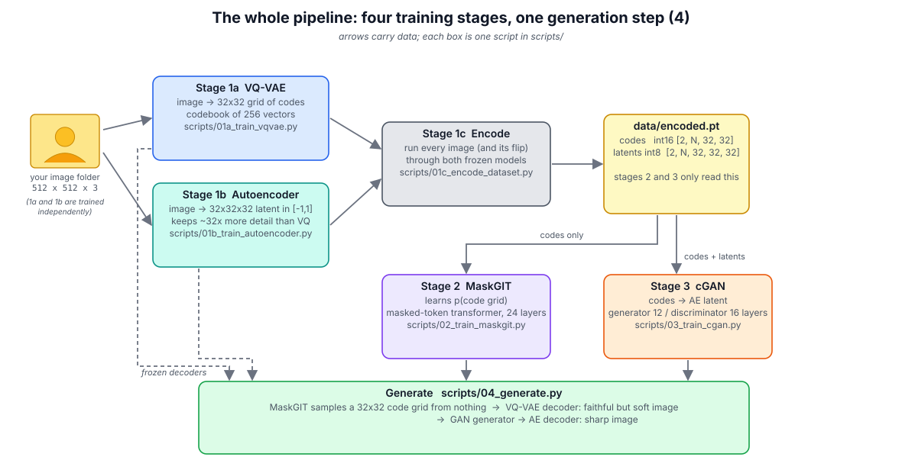
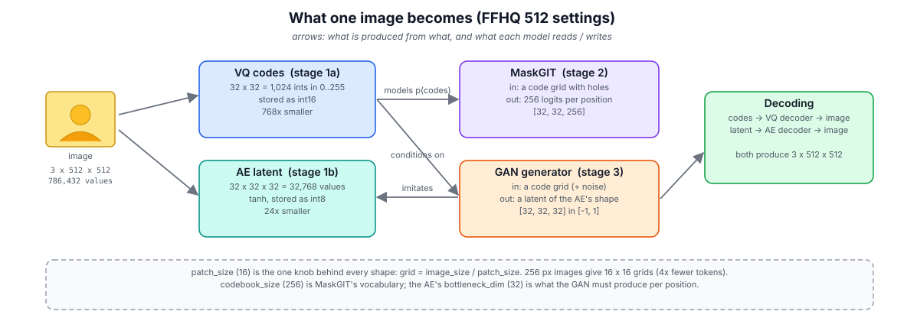
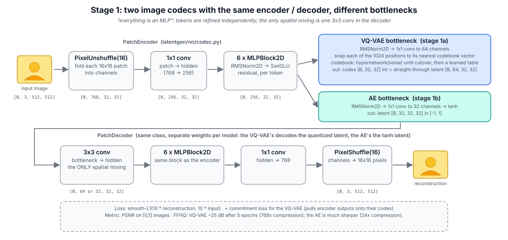
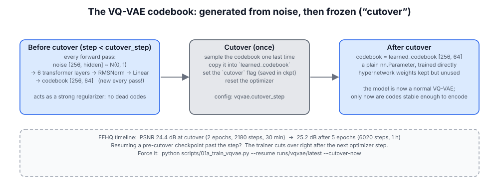
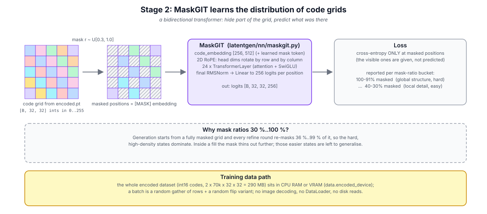
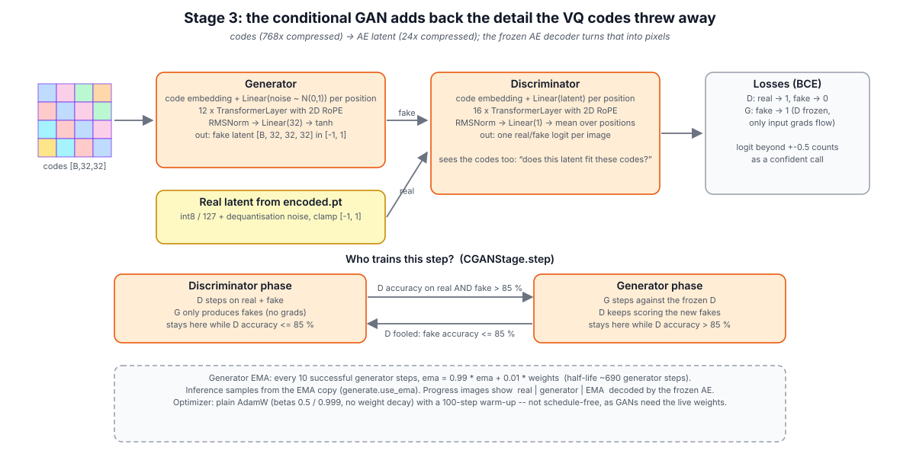
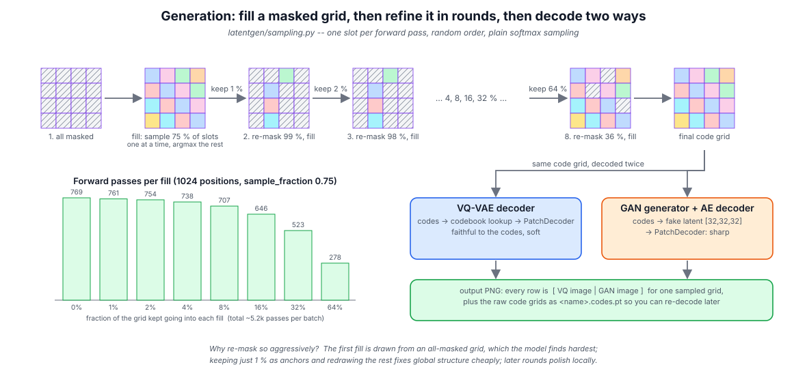
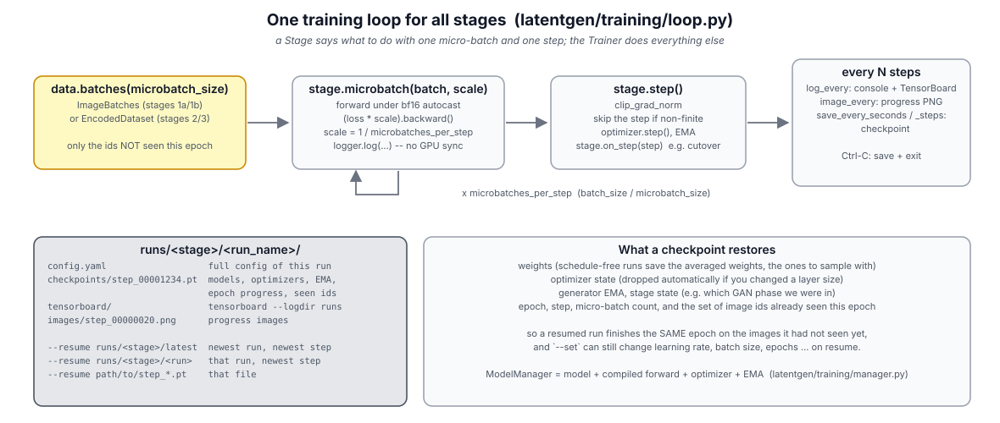

# latentgen — a four-stage latent generative pipeline (VQ-VAE + AE → MaskGIT → conditional GAN)

`latentgen` trains a generative model in four small, independent stages and samples new data with
a MaskGIT-style transformer. It is **dataset-agnostic**: any folder of images (2-D) or of audio
clips (1-D) works — FFHQ at 512×512 is just the configuration the original experiments used.
Ready-made examples pull FFHQ, ImageNet and Speech Commands from Hugging Face
(see [Examples](#15-examples-hugging-face-datasets)).



| Stage | Script | Learns | Reads | Writes |
|---|---|---|---|---|
| 0 (optional) | `scripts/00_compute_dataset_stats.py` | *(nothing)* per-channel mean/std of your images | image folder | `data/dataset_stats.json` |
| 1a | `scripts/01a_train_vqvae.py` | image ⇄ 32×32 grid of discrete codes (vocab 256) | image folder | `runs/vqvae/<run>/` |
| 1b | `scripts/01b_train_autoencoder.py` | image ⇄ 32×32×32 continuous latent | image folder | `runs/autoencoder/<run>/` |
| 1c | `scripts/01c_encode_dataset.py` | *(nothing)* encodes every image once with both models | image folder + 1a + 1b | `data/encoded.pt` |
| 2 | `scripts/02_train_maskgit.py` | the distribution of code grids | `data/encoded.pt` | `runs/maskgit/<run>/` |
| 3 | `scripts/03_train_cgan.py` | codes → detailed latent (adds back what VQ lost) | `data/encoded.pt` | `runs/cgan/<run>/` |
| 4 | `scripts/04_generate.py` | *(nothing)* samples code grids, decodes them two ways | all of the above | `generated/*.png` |

Stages **1a and 1b** are independent of each other; so are **2 and 3**. Everything after 1c
works on a few hundred MB of pre-encoded tensors and never touches the images again.

---

## Table of contents

1. [Quick start](#1-quick-start)
2. [Installation](#2-installation)
3. [The pipeline, stage by stage](#3-the-pipeline-stage-by-stage)
   - [Stage 1a — VQ-VAE with a hypernetwork codebook](#stage-1a--vq-vae-with-a-hypernetwork-codebook)
   - [Stage 1b — continuous autoencoder](#stage-1b--continuous-autoencoder)
   - [Stage 1c — encode the dataset](#stage-1c--encode-the-dataset)
   - [Stage 2 — MaskGIT](#stage-2--maskgit)
   - [Stage 3 — conditional GAN](#stage-3--conditional-gan)
   - [Generation](#generation)
4. [Using your own dataset](#4-using-your-own-dataset)
5. [Configuration](#5-configuration)
6. [Runs, checkpoints, resuming, TensorBoard](#6-runs-checkpoints-resuming-tensorboard)
7. [VRAM and speed](#7-vram-and-speed)
8. [Repository map](#8-repository-map)
9. [Extending the code](#9-extending-the-code)
10. [Migrating from the original scripts](#10-migrating-from-the-original-scripts)
11. [Tests](#11-tests)
12. [Troubleshooting](#12-troubleshooting)
13. [Design notes](#13-design-notes)
14. [Glossary](#14-glossary)
15. [Examples: Hugging Face datasets](#15-examples-hugging-face-datasets)
16. [Audio and other 1-D data](#16-audio-and-other-1-d-data)

---

## 1. Quick start

```bash
git clone <this repo> latentgen && cd latentgen
./install.sh                              # creates .venv, installs PyTorch for your GPU + the rest
source .venv/bin/activate

# 2-minute end-to-end check on synthetic data (also fine on CPU)
python scripts/make_smoke_data.py
bash scripts/run_pipeline.sh configs/smoke_test.yaml

# the real thing: edit data.image_dir in configs/ffhq512.yaml (or copy configs/my_dataset.yaml), then
bash scripts/run_pipeline.sh configs/ffhq512.yaml
tensorboard --logdir runs                 # training curves, in another terminal
```

`run_pipeline.sh` just calls the six scripts in order with the same config (`--from 2` starts at
stage 2 when the encoded data already exists; run it from the repo root or with an absolute config
path). Run the scripts by hand when you want to train two stages in parallel, resume, or tweak
settings between stages.

## 2. Installation

**Requirements:** Python 3.10+, an NVIDIA GPU (Ampere or newer for FlashAttention / bf16; older
GPUs work with a slower attention kernel), PyTorch ≥ 2.4. Linux, WSL2 and Windows are supported
(no macOS: there is no CUDA there).

### `./install.sh` (Linux / WSL)

```
./install.sh              # recommended: .venv + GPU-matched PyTorch + requirements + `pip install -e .`
./install.sh --no-venv    # into the current environment
./install.sh --cpu        # CPU-only PyTorch, only for the smoke test
./install.sh --yes        # don't ask before running the PyTorch install command
```

The script reads your NVIDIA driver version with `nvidia-smi`, picks the newest CUDA wheel that
driver supports (cu128 / cu126 / cu124 / cu121), **prints the exact `pip install torch ...`
command and asks before running it**. AMD ROCm is detected too. If it guesses wrong, install
PyTorch yourself from <https://pytorch.org/get-started/locally/> and re-run `./install.sh` —
it skips PyTorch when a working CUDA build is already present. No GPU at all → the script
stops with instructions rather than installing a CPU build silently.

### `.\install.ps1` (Windows PowerShell)

Same logic; `scripts\run_pipeline.ps1 configs\x.yaml` is the PowerShell twin of `run_pipeline.sh`. Note that `torch.compile` needs Triton, which on native Windows may not be
available: if the first training step fails inside `torch._dynamo`, set `project.compile: false`
in your config (WSL2 does not have this problem).

### Manual

```bash
pip install torch --index-url https://download.pytorch.org/whl/cu126   # pick your CUDA
pip install -r requirements.txt
pip install -e .          # optional: the scripts also work without installing (they add the repo to sys.path)
```

What the non-PyTorch requirements are for: `pyyaml` (configs), `tqdm` (progress bars),
`pillow` (image I/O — no torchvision needed), `tensorboard` (curves), `schedulefree`
(the optimizer used by stages 1a/1b/2), `pytest` (tests).

## 3. The pipeline, stage by stage



Everything is anchored on **`patch_size`** (16): a 512-px image becomes a 32×32 grid of tokens,
and every later model works on that grid. Both image codecs share one architecture
(`latentgen/nn/codec.py`): PixelUnshuffle the image into patches → 1×1 projection → a stack of
per-token MLP blocks → bottleneck → a 3×3 conv (the codec's **only** spatial mixing) → MLP
blocks → 1×1 projection → PixelShuffle back to pixels.



### Stage 1a — VQ-VAE with a hypernetwork codebook

*Code:* `latentgen/nn/vqvae.py`, `latentgen/stages/codec.py::VQVAEStage` · *Config:* `vqvae:`

Turns an image into 1024 integers (a 32×32 grid, each in 0..255) — a 768× compression. It is
deliberately lossy: the codes capture layout and identity, not fine texture. MaskGIT (stage 2)
learns the distribution of these grids because 1024 symbols from a 256-word vocabulary is a
tractable thing to model.

**The codebook is generated, not stored** — at first. A small transformer (`HypernetworkCodebook`)
maps 256 fresh Gaussian vectors to 256 codebook entries *on every forward pass*. The encoder
therefore cannot rely on any particular codebook geometry, no entry can "die", and training is
very stable early on. Once reconstructions are decent (`vqvae.cutover_step`, ~2 epochs on FFHQ),
the stage **cuts over**: it samples the codebook one last time, stores it as a plain learnable
table, bypasses the hypernetwork, and resets the optimizer. From then on it is a normal VQ-VAE.



- Loss: smooth-L1 reconstruction (on 10× scaled images, see `training/losses.py`) + commitment loss.
- Watch: `psnr_db` (FFHQ reached ~25 dB), `codebook_usage` (fraction of codes used per micro-batch;
  it should stay high after cutover), the progress images (`input | reconstruction`).
- Resuming a run from *before* the cutover past the cutover step cuts over right after the next
  optimizer step; `--cutover-now` forces it immediately on resume.
- **Only a cut-over checkpoint can be used downstream.** Before cutover the codes are re-randomised on
  every call, so stage 1c and generation refuse such a checkpoint with a clear error.

### Stage 1b — continuous autoencoder

*Code:* `latentgen/nn/autoencoder.py`, `latentgen/stages/codec.py::AutoencoderStage` · *Config:* `autoencoder:`

Same encoder/decoder, but the bottleneck is a `tanh` projection to 32 channels: a
32×32×32 latent in [-1, 1], 24× compression. It reconstructs much more detail than the VQ-VAE.
Its decoder is what finally turns the GAN's output into pixels; its encoder is only used once,
in stage 1c, to produce the GAN's training targets. Loss: smooth-L1 only. Independent of 1a.

### Stage 1c — encode the dataset

*Code:* `scripts/01c_encode_dataset.py`, `latentgen/data/encoded.py` · *Config:* `encode:`, `data.encoded_file`

Runs every image (and, by default, its horizontal flip) through the frozen VQ-VAE and AE once
and writes a single file:

```
data/encoded.pt
  codes    int16 [V, N, 32, 32]       V = 2 (original, flipped), N = number of images
  latents  int8  [V, N, 32, 32, 32]   AE latent stored as round(x * 127)
  stats    mean/std used to normalise the images
  meta     codebook_size, patch_size, image_size, file list, which checkpoints produced it
```

For 70k FFHQ images that is ~290 MB of codes and ~4.6 GB of latents (layout `[V, N, C, H, W]`,
channels before the grid). Stages 2 and 3 load it into **CPU RAM** (`data.encoded_device: cpu`,
the default) or VRAM (`cuda`, a bit faster if you have the room) and gather random batches by
index: no image decoding, no DataLoader workers, no disk reads after the initial load. `meta.files`
maps row *i* back to the image file, handy when debugging your own dataset.

### Stage 2 — MaskGIT

*Code:* `latentgen/nn/maskgit.py`, `latentgen/stages/maskgit.py` · *Config:* `maskgit:`



A 24-layer bidirectional transformer over the 32×32 grid (2D rotary positions, SwiGLU MLPs,
pre-RMSNorm). Training: each sample gets a random mask ratio in `[mask_ratio_min, mask_ratio_max]`
= [0.3, 1.0]; that fraction of positions is replaced by a learned `[MASK]` embedding and the
model is trained with cross-entropy on the masked positions only.

The grid size and vocabulary are **read from `encoded.pt`**, so the only architectural choices
are `hidden_size`, `intermediate_size`, `num_layers`, `num_attention_heads`. The 30 % lower bound
on the mask ratio matches generation, where every fill starts with 36–100 % of the grid masked
(inside a fill the mask thins out further; those easier, low-density states are left to generalise).

The console shows a table of cross-entropy and accuracy **per mask-ratio bucket** (100–91 %,
90–81 %, … 40–30 % masked). The high-ratio buckets measure global structure (hard, improves
slowly); the low ones measure local consistency (easy). TensorBoard gets the same under
`bucket_ce/*` and `bucket_acc/*`. There are no progress images for this stage; generation is the
test.

Optimizer: schedule-free AdamW with a 1000-step warm-up. Checkpoints hold the *averaged*
weights (the ones to sample with); see [Design notes](#13-design-notes).

### Stage 3 — conditional GAN

*Code:* `latentgen/nn/cgan.py`, `latentgen/stages/cgan.py`, `latentgen/training/ema.py` · *Config:* `cgan:`



The VQ decoder's images are faithful to the codes but soft. The GAN learns to turn a code grid
into the **AE latent** the real image would have had, hallucinating plausible detail; the frozen
AE decoder renders it. Both networks are transformers over the grid:

- **Generator** (12 layers): code embedding + a projection of per-position Gaussian noise →
  transformer → `tanh` → `[B, 32, 32, 32]`.
- **Discriminator** (16 layers): code embedding + projection of the latent → transformer →
  one logit per image. Because it sees the codes, it judges *"does this latent fit this grid?"*,
  not just "is this a latent?".

**Turn-taking schedule.** At every optimizer step one network trains:
the discriminator while its accuracy on the previous step's reals *and* fakes is ≤ 85 %
(`disc_accuracy_threshold`; a call only counts when the logit is beyond ±`disc_logit_margin`);
the generator — against a frozen discriminator — while it is above. Each side trains only while
it is behind, which keeps the game balanced without hand-tuned step ratios.
`phase_generator` in TensorBoard shows who trained when.

The generator keeps an **EMA** copy (`ema_decay` 0.99 every `ema_every` 10 generator steps,
half-life ≈ 690 generator steps); generation samples from it. Progress images show
`real | generator | EMA` decoded by the AE. Optimizer: plain AdamW (β = 0.5/0.999, no weight
decay, 100-step warm-up).

### Generation

*Code:* `latentgen/sampling.py`, `scripts/04_generate.py` · *Config:* `generate:`



1. Start from an all-masked grid. **Fill**: pick a random still-masked slot, run the model,
   sample that slot from the softmax, commit it — one forward pass per slot — for
   `sample_fraction` (75 %) of the masked slots; then one more pass fills the rest with the argmax.
2. **Refine**: for each `keep` in `keep_schedule` (1 %, 2 %, 4 %, … 64 %), keep a random
   `keep` fraction of the finished grid, re-mask everything else, fill again. Early rounds throw
   almost everything away (global structure is redrawn around a few anchors), late rounds polish.
3. **Decode** the final grid with the VQ-VAE (soft, faithful) and/or GAN + AE (sharp).

No temperature, top-k or confidence ordering — on purpose (see design notes). ~5.2 k forward
passes per batch, so generation takes a while; raise `generate.batch_size` to amortise.

Output: one PNG per batch in `generate.out_dir`, each row `[VQ | GAN]` for one grid, plus the
raw grids as `<name>.codes.pt`. `generate.num_images: 0` runs until Ctrl-C.

## 4. Using your own dataset

1. **Put images in a folder.** Any names, any of png/jpg/jpeg/webp/bmp, sub-folders are searched.
   Images are resized (shorter side) and centre-cropped to `data.image_size`. (Audio: a folder of
   `.wav` files and `data.kind: audio`, see [§16](#16-audio-and-other-1-d-data). Hugging Face
   datasets: [§15](#15-examples-hugging-face-datasets).)
2. **Copy the template:** `cp configs/my_dataset.yaml configs/cats.yaml` and edit
   `data.image_dir`, `data.image_size` (must be a multiple of `patch_size`; 256 gives a 16×16 grid
   and is a good start on a small GPU), and `project.runs_dir` (keeps this dataset's runs apart;
   every `*_checkpoint: latest` follows it automatically).
3. **(Optional) normalisation stats:** `python scripts/00_compute_dataset_stats.py --config configs/cats.yaml`
   writes `data/dataset_stats.json`; set `data.stats_file` to it. The FFHQ defaults are fine for
   any natural photos. The stats travel with every checkpoint and with `encoded.pt`, so
   downstream stages and generation never need the config for them.
4. **Keep one `patch_size`.** `vqvae.model.patch_size` and `autoencoder.model.patch_size` must be
   equal (stage 1c checks); both default to 16.
5. **Scale the schedule.** `vqvae.cutover_step` is in optimizer steps — aim for ~2 epochs of your
   data (`2 * num_images / batch_size`). Small datasets need more `epochs` for the same number of
   samples seen. Smaller grids (256 px) need fewer transformer layers.
6. `bash scripts/run_pipeline.sh configs/cats.yaml` (`scripts\run_pipeline.ps1` on native Windows).

A few things to know:

- `data.image_size` must be a multiple of `patch_size` (checked at start-up).
- The image id is the index in the sorted file list; it is what the epoch bookkeeping and
  `encoded.pt` use. Adding or removing images between stage 1 and stage 1c is fine (1c
  re-lists); between 1c and stages 2/3 it is irrelevant (they only read `encoded.pt`).
- Non-square or very large images are fine; they are cropped and resized on load. Loading is
  done by `num_workers` DataLoader processes; raise it if the GPU waits for data.
- Grayscale images are converted to RGB.

## 5. Configuration

One YAML per experiment, same file for every stage. **All defaults live in
`latentgen/config.py`** as dataclasses with a comment per field; a YAML only lists what differs,
and a partial section keeps the rest of *that stage's* defaults (e.g. `cgan: {train: {epochs: 5}}`
keeps the GAN's plain-AdamW optimizer).
`configs/ffhq512.yaml` lists everything with comments; `configs/my_dataset.yaml` lists the
few things that usually change; `configs/smoke_test.yaml` shrinks everything.

```yaml
data:
  image_dir: /data/images
vqvae:
  train: {epochs: 20, microbatch_size: 4}
  cutover_step: 3000
```

Override anything on the command line. Values are parsed as YAML and then coerced to the type of
the default (`null`, `[1, 2]`, `true`, `1e-4` all work; `1e-4` becomes the float `0.0001` even
though YAML itself would read it as a string, which is also why the YAML files write `3.0e-4`):

```bash
python scripts/02_train_maskgit.py --config configs/ffhq512.yaml --set maskgit.model.num_layers=12 maskgit.train.optimizer.lr=2e-4
```

Unknown keys are an error that lists the valid keys, so typos cannot silently do nothing.

Sections: `project` (runs dir, seed, compile, allow_cpu) · `data` (images, encoded file, where
it lives) · `vqvae` / `autoencoder` / `maskgit` / `cgan` (each with `model`, `train` and
stage-specific keys) · `encode` · `generate`. Every `train` section has the same keys:

| key | meaning |
|---|---|
| `epochs` | passes over the data |
| `batch_size` | samples per optimizer step |
| `microbatch_size` | samples per forward/backward; `batch_size / microbatch_size` gradient-accumulation steps |
| `grad_clip` | gradient-norm clip (`0` = no clipping); a non-finite norm always skips the step |
| `log_every` | optimizer steps between console/TensorBoard logs |
| `image_every` | optimizer steps between progress images (0 = never) |
| `save_every_seconds`, `save_every_steps` | checkpoint cadence (either triggers) |
| `activation_checkpointing` | recompute activations in backward: much less VRAM, ~30 % slower |
| `optimizer.type` | `adamw_schedulefree` or `adamw` (+ `lr`, `betas`, `weight_decay`, `warmup_steps`) |

The `*_checkpoint` keys (`encode.vqvae_checkpoint`, `cgan.autoencoder_checkpoint`,
`generate.*_checkpoint`) say which earlier-stage model to use. `latest` (the default) means the
run of that stage under `project.runs_dir` whose checkpoint was written most recently, so changing `runs_dir` for a new dataset is
enough; a run name (`20250102_120000_a1b2c3`), a run directory or a `step_*.pt` file pin a specific
model. `cgan.autoencoder_checkpoint` is needed only for progress images (`cgan.train.image_every: 0`
to train without it).

## 6. Runs, checkpoints, resuming, TensorBoard



Every training script writes to `runs/<stage>/<run_name>/` (`--run-name` to choose, default
`<timestamp>_<id>`):

```
runs/vqvae/20250102_120000_a1b2c3/
  config.yaml                    the full, resolved config of this run
  checkpoints/step_00002200.pt   models + optimizers + EMA + epoch progress + seen image ids
  tensorboard/                   tensorboard --logdir runs
  images/step_00000020.png       progress images
```

- `--resume runs/vqvae/latest` (or a run dir, or a file) continues in the **same run directory**
  and with **the run's own `config.yaml`** (`--config` is ignored, with a notice), so a resumed run is
  the same experiment: same model sizes, same data. `--set` still applies on top, so you can change
  the learning rate, batch size, epochs, … on resume (the new values overwrite the ones stored in
  the optimizer state). The run's `config.yaml` is rewritten with the resolved config.
- A resumed run finishes the current epoch on the images it had not seen yet. Ctrl-C lets the
  optimizer step in progress complete before saving, so no micro-batch is ever lost or applied twice.
- **Ctrl-C saves a checkpoint and exits** (a second Ctrl-C aborts). With `--pdb` the next step
  boundary drops into pdb inside the trainer loop: `self` is the trainer, `self.save()` writes a
  checkpoint, `c` continues training.
- If you change a layer size and resume, the overlapping slice of each changed tensor is copied
  (e.g. growing the codebook keeps the old entries) and the optimizer state is reset.
- Checkpoint files are written atomically (`.tmp` then rename): a crash never leaves a half
  file. Old step files are never deleted — prune them yourself.
- Checkpoints are self-describing: they carry the full config and the image stats, so
  `scripts/04_generate.py` and `01c` only need paths.

TensorBoard tags: `train/*` (losses, PSNR, grad norms, GAN accuracies), `bucket_ce/*`,
`bucket_acc/*` (MaskGIT), `lr/*`, `steps/*`, `timing/step_ms`, `count/*` (skipped steps etc.),
`progress/epoch`.

## 7. VRAM and speed

Estimates for the FFHQ-512 config (bf16 autocast, FlashAttention, `compile: true`) — not
measurements; check yours with `nvidia-smi` and `timing/step_ms`:

| stage | default micro-batch | ≈ VRAM (estimate) | first things to turn down |
|---|---|---|---|
| 1a VQ-VAE (16 M params) | 8 images | 5–6 GB | `microbatch_size: 4`, `activation_checkpointing: true` |
| 1b AE (10 M) | 8 images | 5–6 GB | same |
| 1c encode | 16 images | 3 GB | `encode.batch_size` |
| 2 MaskGIT (101 M) | 16 grids | 6–8 GB | `microbatch_size: 8`, `activation_checkpointing: true`, fewer layers |
| 3 cGAN (50 M + 67 M) | 16 grids | 7–9 GB | same; the discriminator sees 2× the batch |
| generate | 2 | 2 GB | — |

Knobs, in order of effect:

1. **`microbatch_size`** — halve it, keep `batch_size`: identical maths, half the activation
   memory, slightly slower. The one knob that always works.
2. **`activation_checkpointing: true`** — roughly divides activation memory by the number of
   layers at ~30 % extra compute.
3. **`data.encoded_device: cpu`** (default) — keeps the 5 GB encoded dataset out of VRAM.
4. Model size: `num_layers`, `hidden_size`. For a first run on a new dataset, the
   `my_dataset.yaml` sizes are plenty.
5. `project.compile: false` — saves the compile-time memory spike and the slow first step, costs
   ~30–50 % throughput afterwards.

With 1–3 the whole pipeline fits in **~4–6 GB**. Speed: `torch.compile` and FlashAttention are
the big ones (both on by default; the attention kernel falls back automatically with a warning
on GPUs older than Ampere). `timing/step_ms` in TensorBoard is the number to watch.

## 8. Repository map

```
latentgen/                     the library (import latentgen)
  config.py                  every setting, its default and its comment; YAML + --set loading
  device.py                  GPU selection, bf16 autocast, FlashAttention probe/fallback, torch.compile, seeding
  cli.py                     argparse + setup shared by the scripts
  pretrained.py              load frozen models from checkpoints (used by 1c, 3, generate)
  sampling.py                MaskGIT fill/refine sampling + the two decode paths
  nn/
    layers.py                Attention, SwiGLU, TransformerLayer, 2D RoPE, RMSNorm2D, MLPBlock2D, activation checkpointing
    codec.py                 PatchEncoder / PatchDecoder shared by both image codecs
    vqvae.py                 HypernetworkCodebook, VectorQuantizer, VQVAE
    autoencoder.py           TanhBottleneck, Autoencoder
    maskgit.py               MaskGIT, masked cross-entropy, random masks
    cgan.py                  Generator, Discriminator
  data/
    normalization.py         ImageStats (mean/std; FFHQ defaults; JSON load/save)
    images.py                image folder dataset + epoch-aware batch iterator (stages 1a/1b/1c)
    audio.py                 wav folder dataset, wav read/write, waveform drawing (data.kind: audio)
    encoded.py               the encoded dataset file: writer + CPU/GPU-resident batch sampler (stages 2/3)
    epoch.py                 EpochTracker: which ids were seen this epoch (saved in checkpoints)
  training/
    loop.py                  Stage interface + Trainer (accumulation, logging, images, checkpoints, Ctrl-C)
    manager.py               ModelManager: model + compiled forward + optimizer + EMA + clip/step + state
    optim.py                 schedule-free AdamW / AdamW+warm-up behind one interface
    ema.py                   EMA weights
    checkpoint.py            checkpoint format, run directories, path resolution, tolerant state-dict merge
    logging.py               TensorBoard + console metrics without per-step GPU syncs
    images.py                progress-image grids, background PNG writer
    losses.py                smooth-L1 reconstruction loss, PSNR
  stages/
    codec.py                 VQVAEStage, AutoencoderStage   (stages 1a, 1b)
    maskgit.py               MaskGITStage + per-mask-ratio buckets (stage 2)
    cgan.py                  CGANStage + discriminator scoring / phase schedule (stage 3)
scripts/                     one thin CLI per stage (00 stats, 01a, 01b, 01c, 02, 03, 04), run_pipeline.sh / .ps1,
                             make_smoke_data.py, convert_legacy.py
configs/                     ffhq512.yaml (everything, commented), my_dataset.yaml (template), smoke_test*.yaml,
                             examples/ (FFHQ-128, ImageNet-256, Speech Commands from Hugging Face)
examples/prepare_hf_dataset.py  streams a Hugging Face image / audio dataset into the folder layout
docs/                        the diagrams (SVG + PNG) and make_diagrams.py that draws them
tests/                       pytest: config, checkpoint paths, model shapes & parameter names/order, training
                             round-trips, sampling, end-to-end smoke run
notes/original_notes.txt     the notes that came with the original scripts
install.sh / install.ps1     installers; requirements.txt; pyproject.toml
```

## 9. Extending the code

- **A new loss term for the VQ-VAE:** `latentgen/stages/codec.py::VQVAEStage.forward_and_loss`
  returns `(reconstruction, loss)`; add your term there and `logger.log` it.
- **A different sampling strategy:** `latentgen/sampling.py::fill` is 20 lines; temperature,
  top-k or confidence-based ordering all go there. `scripts/04_generate.py` only calls
  `generate_codes` / `decode_*`.
- **A new model / training stage:** subclass `latentgen.training.loop.Stage` (see
  `stages/codec.py`, the shortest example). Set `name` (= its config section), call
  `super().__init__(cfg, device, data, stats)`, create your `ModelManager`(s) in `self.managers`,
  implement `microbatch(batch, scale, logger)` (forward + `(loss * scale).backward()`); the default
  `step` clips and steps a single manager (override it for several). Optional hooks:
  `progress_image`, `on_log`, `on_step`, `discard_partial_step`, `state_dict`/`load_state_dict`.
  The data source needs `.tracker`, `.batches()`, `.batches_per_epoch()`, `.num_items`. Copy one
  of the scripts for the CLI.
- **Progress images for MaskGIT:** implement `MaskGITStage.progress_image` by sampling a few
  grids with `latentgen.sampling.generate_codes` and decoding them with a frozen VQ-VAE (load it
  with `latentgen.pretrained.load_vqvae`), then set `maskgit.train.image_every`.
- **Another optimizer:** add a branch to `latentgen/training/optim.py::Optimizer.__init__`; the
  rest of the code only uses `step`, `zero_grad`, `eval_weights`, `current_lr`, `state_dict`.
- **Other image sizes / grids:** nothing is hard-coded to 32×32 or 512; set `data.image_size`
  and `patch_size`. `head_dim = hidden_size / num_attention_heads` must be a multiple of 8 (2D
  RoPE needs 4, FlashAttention needs 8 and ≤ 256) — the defaults use 32.

Parameter and buffer names inside the models (`qkv_proj`, `fused_proj`, `premlp_norm`,
`down_proj_global`, `lowres_quantized_code_embedding`, …) are the checkpoint format; renaming
them breaks loading of existing checkpoints (`tests/test_models.py` guards the important ones).

## 10. Migrating from the original scripts

Model weights are byte-for-byte compatible (every parameter kept its name). Only the container
format changed, so a one-time conversion is enough:

| original | now |
|---|---|
| `train_stage_1a_vqvae_hyperparameter_codebook.py` | `scripts/01a_train_vqvae.py` + `latentgen/nn/vqvae.py` + `latentgen/stages/codec.py` |
| `train_stage_1b_ae.py` | `scripts/01b_train_autoencoder.py` + `latentgen/nn/autoencoder.py` |
| `build_dataset_stage_1c.py` | `scripts/01c_encode_dataset.py` + `latentgen/data/encoded.py` |
| `train_stage_2_mask_git.py` | `scripts/02_train_maskgit.py` + `latentgen/nn/maskgit.py` + `latentgen/stages/maskgit.py` |
| `train_stage_3_cgan.py` | `scripts/03_train_cgan.py` + `latentgen/nn/cgan.py` + `latentgen/stages/cgan.py` |
| `inference.py` | `scripts/04_generate.py` + `latentgen/sampling.py` |
| `models/*.pth` (one per model) | `runs/<stage>/<run>/checkpoints/step_*.pt` (one per stage; GAN G+D in one file) |
| `data/all_vq_codes.pt` + `data/all_latents.pt` | `data/encoded.pt` |
| hard-coded paths / sizes at the bottom of each script | `configs/*.yaml` |
| `breakpoint()` to cut over the codebook | `vqvae.cutover_step` (automatic) or `--cutover-now` |
| Ctrl-C → pdb | Ctrl-C → save + exit (`--pdb` for the old behaviour) |
| `FFHQDataset` (70 000 fixed `%05d.png` names) | any folder of images |
| `RandomizedCodebook` | `HypernetworkCodebook` (same weights, clearer name) |

```bash
python scripts/convert_legacy.py checkpoint --stage vqvae       --input models/vqvae_stage_1a_bcb5a61d_vq_32x32_epoch_5_step_6021_vqvae.pth
python scripts/convert_legacy.py checkpoint --stage autoencoder --input models/ae_stage_1b_d13b7496_ae_32x32_epoch_7_step_7761_ae.pth
python scripts/convert_legacy.py checkpoint --stage maskgit     --input models/6699378d_maskgit_24_epoch_106_step_58363_mask_git.pth
python scripts/convert_legacy.py checkpoint --stage cgan \
    --input         /mnt/f/models_trained/97f294f7_76410/97f294f7_gen_12_epoch_139_step_76410_generator.pth \
    --discriminator /mnt/f/models_trained/97f294f7_76410/97f294f7_disc_16_epoch_139_step_76410_discriminator.pth
python scripts/convert_legacy.py dataset --codes data/all_vq_codes.pt --latents data/all_latents.pt
```

Converted checkpoints land in `runs/<stage>/legacy/checkpoints/` together with a `config.yaml`
(when `--output` is not given), so `runs/<stage>/latest` finds them, `scripts/04_generate.py`
works unchanged, and `--resume runs/<stage>/legacy` continues training with the optimizer state
(and the generator's EMA) carried over; `--drop-optimizer` starts the optimizer fresh. Optimizer
state is matched to parameters *by position*, which is why the modules are registered in the
original order (guarded by `tests/test_models.py`) and why a shape mismatch is detected before any
weight is touched. The VQ-VAE/AE architecture is
taken from `--config` (the originals did not store it); the converter strict-loads the weights
into a model built from that config and tells you if they do not match. The original GAN had a
1024-entry code embedding (its config default) although only 256 codes exist; the converter keeps
that size and `fill_from_data` accepts a larger-than-needed vocabulary.

Behavioural differences worth knowing: the VQ nearest-code search uses the expanded-distance
formula in fp32 with autocast disabled (no `[B, K, D, H, W]` intermediate; far less memory; code
assignments can differ from the original's bf16 element-wise distances only at near-ties) and the
commitment loss is computed in fp32; stage-1 warm-up is schedule-free's own `warmup_steps` instead of an extra
LambdaLR; the GAN's progress images are step-based (`image_every`) instead of wall-clock based;
the MaskGIT bucket table is identical; the accumulation window left over at the end of an epoch is
dropped instead of carried into the next epoch; the cutover codebook is sampled in fp32 outside
autocast (the original sampled it in bf16).

## 11. Tests

```bash
pytest tests/ -q                                       # ~2 min, CPU only
pytest tests/test_config.py tests/test_paths.py -q     # no torch needed
```

- `test_config.py` — defaults, YAML, overrides, error messages, the shipped configs load.
- `test_models.py` — shapes of all five models on tiny configs, cutover, and the parameter
  names *and registration order* existing checkpoints depend on.
- `test_paths.py` — `latest` / run-name / file resolution of `*_checkpoint` values (no torch needed).
- `test_sampling.py` — fill-plan arithmetic, every slot gets filled.
- `test_training.py` — a checkpoint holds the schedule-free *averaged* weights, resume round-trips
  (with an LR override), EMA round-trips.
- `test_pipeline.py` — runs all six scripts on synthetic 64-px images in a temp dir, including a
  resume across the cutover.

The code in this repository was written and reviewed without a GPU at hand; the test suite is
the first thing to run after installing.

## 12. Troubleshooting

**`No CUDA GPU detected`** — install the matching PyTorch build (`./install.sh`). On WSL2 the
Windows driver is enough; `nvidia-smi` must work inside WSL. `project.allow_cpu: true` only
for the smoke test.

**`FlashAttention is unavailable` warning** — pre-Ampere GPU (or CPU). Training works, just
slower and hungrier. Nothing to do.

**CUDA out of memory** — see [VRAM and speed](#7-vram-and-speed): lower `microbatch_size`
first, then `activation_checkpointing: true`.

**The first step takes minutes / `torch._dynamo` errors** — that is `torch.compile`. It is
worth it for long runs; for short experiments or on native Windows set `project.compile: false`.

**`unknown config key(s)`** — a typo in the YAML or `--set`; the message lists the valid keys
of that section.

**`... is not a format-2 checkpoint`** — a file from the original scripts; run
`scripts/convert_legacy.py checkpoint`.

**`this VQ-VAE has not cut over`** — you pointed stage 1c or generation at a checkpoint from
before `cutover_step`; train longer or `python scripts/01a_train_vqvae.py --resume <run> --cutover-now`.

**Stage 2/3 slow to start** — the encoded file is being read; with `encoded_device: cuda` it is
also copied to the GPU. ~10 s for FFHQ.

**MaskGIT samples are garbage** — look at the bucket table: the 100–91 % bucket must get well
below `ln(256) ≈ 5.5` nats. On FFHQ, usable samples needed ~50 epochs. Also check that the
VQ-VAE used for 1c was cut over and that `generate.vqvae_checkpoint` is that same model.

**GAN stuck in one phase** — `train/disc_acc_real` / `disc_acc_fake` tell you which side is
winning (`disc_acc_real` is only logged on discriminator steps, since generator steps score no
reals). A discriminator that never reaches 85 % needs more layers or a lower generator LR; one
that is never fooled usually means the generator LR is too low or the EMA progress images are
misleading you (they lag by ~700 steps).

**Reproducibility** — set `project.seed`; note that `torch.compile`, bf16 and CUDA kernels are
not bit-exact across runs anyway.

## 13. Design notes

*Why MLP-only image codecs?* Every token is processed independently except for one 3×3 conv in
the decoder. That makes the encoder's job purely local (good for a VQ bottleneck: each code
describes its patch and only its patch), keeps the codecs small (10–16 M parameters), and leaves all the
global reasoning to the transformers that work on the grid.

*Why the hypernetwork codebook?* Codebook collapse (most entries unused) is the classic VQ-VAE
failure. Regenerating the codebook from noise every step makes collapse impossible — there is
no fixed entry to collapse onto — and forces the encoder to produce well-spread features. The
cutover then gives the usual benefits of a fixed table (stable codes for stage 1c, learnable
entries). The original notes record 24.4 dB PSNR at cutover and 25.2 dB after further training.

*Why both a VQ-VAE and a continuous AE?* The discrete codes make the generative modelling
tractable (MaskGIT); the continuous latent makes the output sharp (GAN + AE decoder). The GAN
is conditioned on the codes, so the two paths always agree on layout and the GAN only has to
add detail — a far easier task than unconditional image synthesis.

*Why schedule-free AdamW for stages 1a/1b/2?* No LR schedule to tune, and the weight average
it maintains is usually a better model than the last iterate. The subtlety: the weights the
optimizer steps on (`y`) are not the ones to evaluate with (`x`); `Optimizer.eval_weights()`
swaps them, and checkpoints always store `x`. The GAN uses plain AdamW because the discriminator
needs to react to the generator's *current* weights.

*Why the simple sampler?* Confidence-ordered parallel decoding (the MaskGIT paper's trick)
needs far fewer passes but tends to produce over-smooth, mode-seeking samples. Sampling one
slot at a time from the plain softmax is exact ancestral sampling in a random order; the
keep-and-refill rounds repair the early mistakes that any order makes. It is slow but simple and
it is the baseline everything else should beat — `sampling.fill` is the place to experiment.

*Why turn-taking in the GAN?* Fixed `n_critic` ratios assume the two networks learn at a fixed
relative speed. Letting the discriminator train until it is confidently right and the generator
train until it is not is a feedback controller for the same thing and needs no tuning when
model sizes change.

*Why keep everything on the GPU and sync once per step?* Metrics are accumulated as tensors and
converted to floats only at log time; codebook usage is counted with a `scatter_` rather than
`bincount` (which syncs); the discriminator's accuracy counters live on the GPU and are read once
per step. The only forced syncs per step are the `isfinite(grad_norm)` check and, in the GAN, that
accuracy read. This is what lets the small models here run at thousands of samples per second.

## 14. Glossary

- **token / position / slot** — one cell of the 32×32 grid.
- **code** — the integer (0..255) a VQ-VAE assigns to a token; **code grid** — the `[32, 32]` array.
- **codebook** — the `[256, 64]` table of vectors a code indexes into.
- **latent** — the continuous `[32, 32, 32]` tensor from the autoencoder (or the GAN).
- **cutover** — the moment the VQ-VAE freezes its hypernetwork-generated codebook into a table.
- **mask ratio** — fraction of a grid hidden from MaskGIT in one training sample.
- **fill / refine** — one pass of MaskGIT sampling / the keep-and-re-mask rounds after the first fill.
- **micro-batch** — the samples in one forward/backward; **batch** — the samples in one optimizer step.
- **EMA** — exponential moving average of the generator's weights; smoother than the live weights.
- **run** — one invocation of a training script and its directory `runs/<stage>/<run_name>/`.

## 15. Examples: Hugging Face datasets

`examples/prepare_hf_dataset.py` streams any Hugging Face dataset into the plain folder layout the
pipeline reads (needs `pip install "datasets[audio]"`, nothing else changes). Three ready-made
configs live in `configs/examples/`:

| example | prepare | train |
|---|---|---|
| FFHQ 128 px (70k faces, small and fast) | `python examples/prepare_hf_dataset.py images --dataset nuwandaa/ffhq128 --out data/ffhq128 --size 128` | `bash scripts/run_pipeline.sh configs/examples/hf_ffhq128.yaml` |
| ImageNet-1k 256 px (gated: accept the terms on the dataset page, then `huggingface-cli login`) | `python examples/prepare_hf_dataset.py images --dataset ILSVRC/imagenet-1k --split train --out data/imagenet256 --size 256 --max-items 200000` | `bash scripts/run_pipeline.sh configs/examples/hf_imagenet256.yaml` |
| Speech Commands (1-s spoken words, 16 kHz, audio) | `python examples/prepare_hf_dataset.py audio --dataset google/speech_commands --config v0.02 --out data/speech_commands` | `bash scripts/run_pipeline.sh configs/examples/hf_speech_commands.yaml` |

`--max-items` stops the stream early, so you can try a dataset on a few thousand items first.
Any other dataset works the same way: `--dataset <id> [--config <name>] [--column <image or audio column>]`.
Each example config only overrides what differs from the defaults and says why in its comments —
they double as a worked answer to "how do I size this for my data?".

## 16. Audio and other 1-D data

Set `data.kind: audio` and the **same four stages run one-dimensionally**:

- `data.image_dir` is a folder of 16-bit PCM `.wav` files (the key name is shared with images);
  clips are cropped / zero-padded to `data.audio_length` samples and loaded with the standard
  library (`latentgen/data/audio.py`), no audio dependency.
- The codecs (`latentgen/nn/codec.py`) fold `patch_size` neighbouring samples into channels
  instead of `patch_size × patch_size` pixels, and carry the signal through the pipeline as a
  grid with height 1: a 16384-sample clip becomes a `1 × 1024` grid of VQ codes plus a
  `32 × 1 × 1024` fine latent — exactly the token count of a 32×32 image, so MaskGIT and the
  GAN need no changes at all (`grid_h = 1`).
- Augmentation is polarity inversion (the audio analogue of a horizontal flip); progress images
  draw waveforms; `scripts/04_generate.py` writes `.wav` files for every sample and decoder plus
  a waveform PNG; `scripts/00_compute_dataset_stats.py` computes a single-channel mean/std.
- `configs/smoke_test_audio.yaml` + `python scripts/make_smoke_data.py --audio` is the 1-D
  smoke test (`tests/test_pipeline.py` runs it too).

Other 1-D signals (sensor traces, EEG, …) only need a loader that returns `[1, T]` tensors;
multi-channel 1-D data additionally needs `channels` in the codec configs (filled from
`data.kind` today — see `ImageCodecStage.__init__`).
